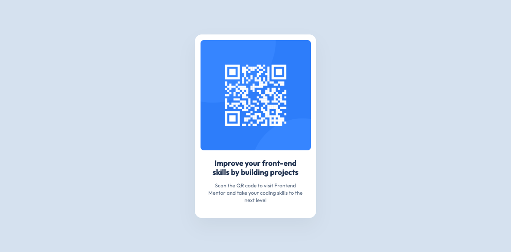

# QR code component

This is a a simple website that shows a QR code component.

## Table of contents

- [Overview](#overview)
  - [Screenshot](#screenshot)
  - [Links](#links)
- [My process](#my-process)
  - [Built with](#built-with)
- [Author](#author)

## Overview

### Screenshot

### Links

- Live Site URL: [Qr Code Website](https://geylankalafmohe.github.io/web-qr-code/)

## My process

### Built with

- Semantic HTML5 markup
- CSS global variables for fonts and colors
- Web-first workflow

## Author

- LinkedIn - [Geylan Kalaf Mohe](https://sa.linkedin.com/in/geylan-kalaf-mohe-1366a220b)
